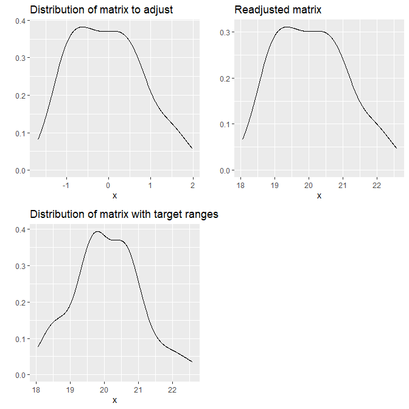
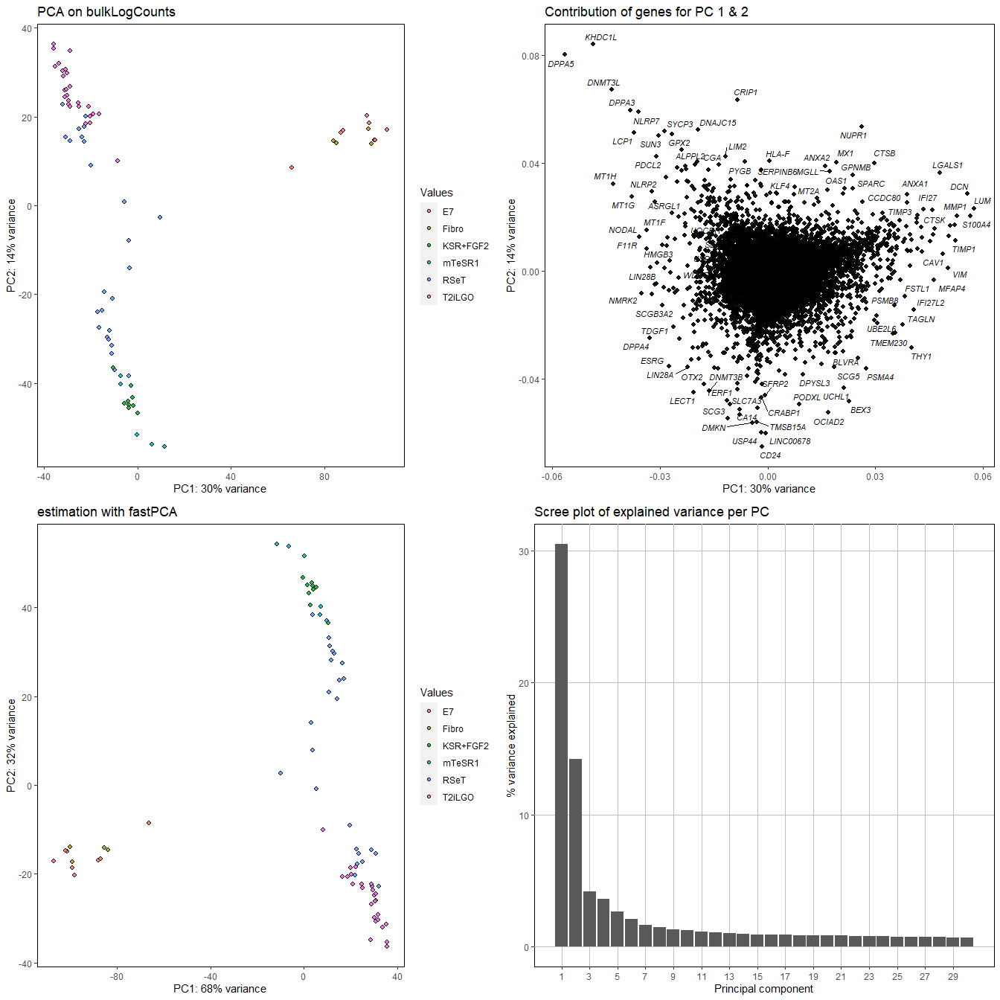
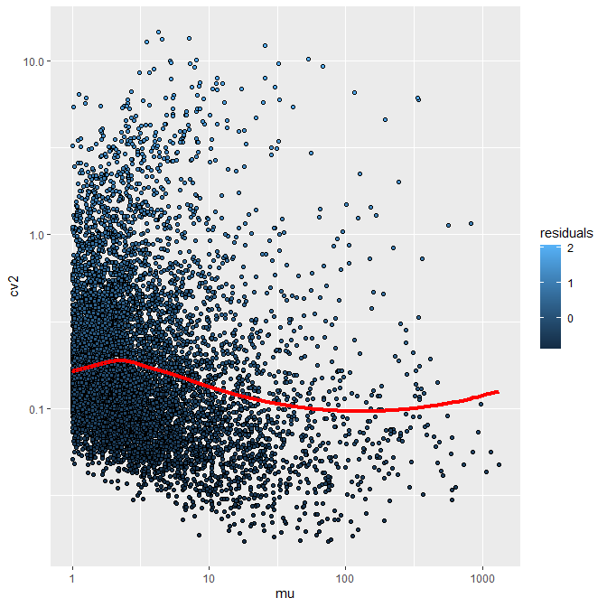
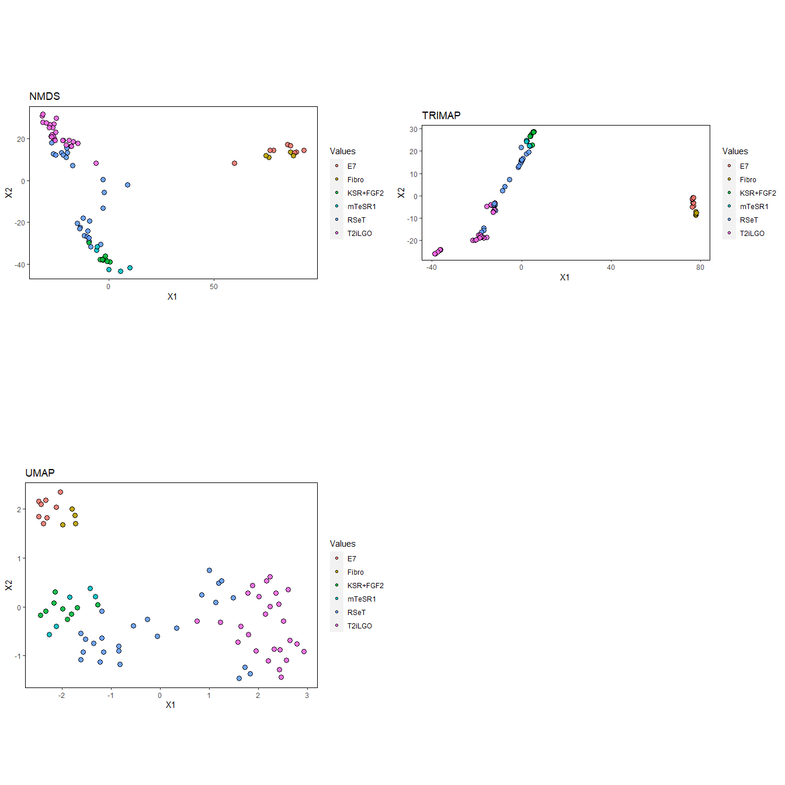
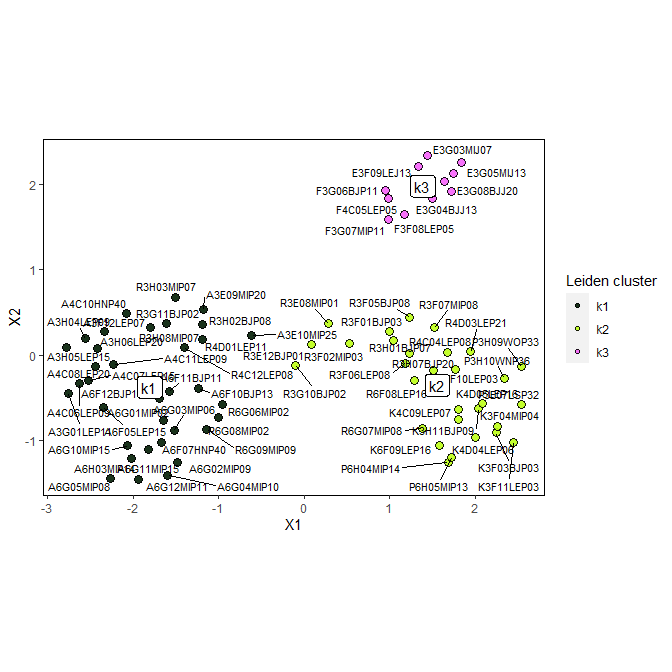
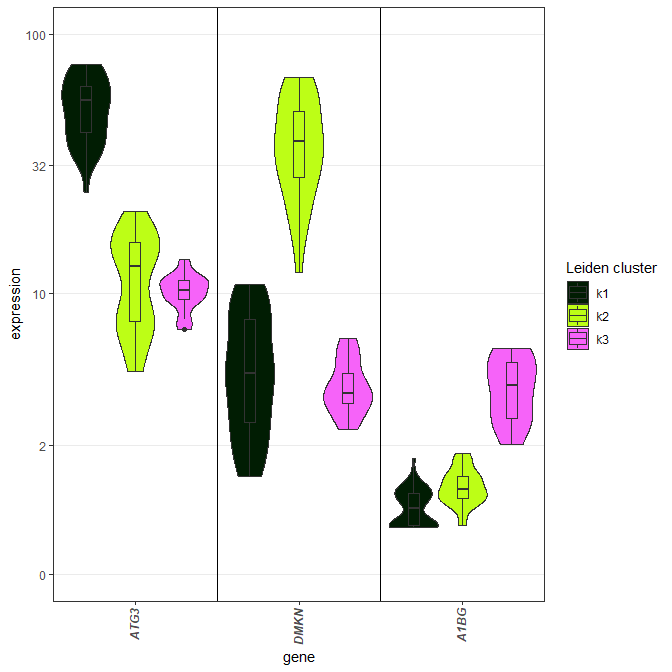
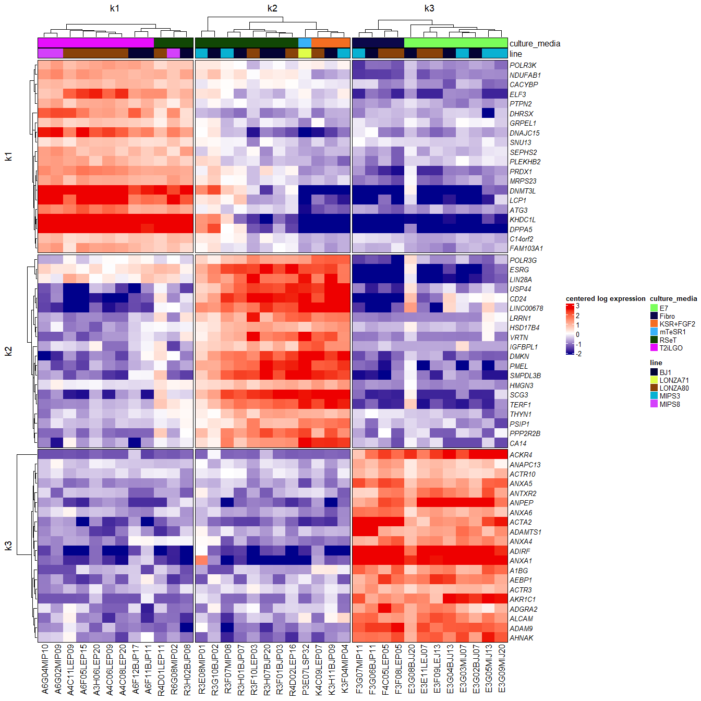
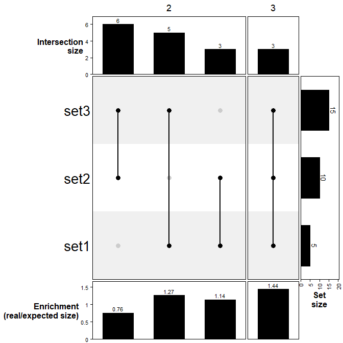
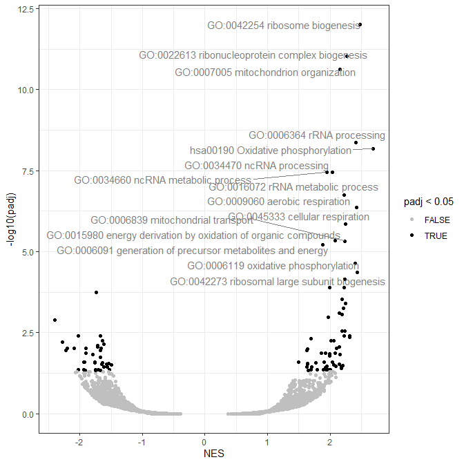
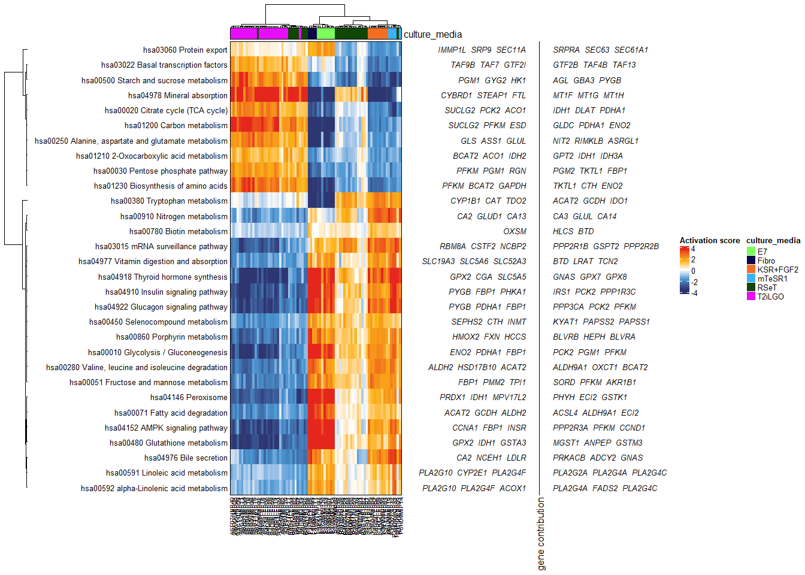

# oob: a toolbox for analyzing OMIC data, Out Of Bounds of black boxes.

This package provide function for analyzing OMIC data, with a focus on plots, functional enrichment and bulk/single-cell RNA-Seq.

## Installation

In a R console: 

```{r}
install.packages("devtools")
devtools::install_github("https://github.com/DimitriMeistermann/oob")
```

*oob* needs also several python dependencies accessible in the environment used by *reticulate*, the R package for calling python functions. See [https://rstudio.github.io/reticulate/articles/python_packages.html](https://rstudio.github.io/reticulate/articles/python_packages.html) for more information on installation of python package via reticulate.

For a quick installation:
```{r}
reticulate::py_install(c("igraph","numpy","leidenalg","trimap"))
```
# Functionalities of oob

``` r
library(oob)
```

## Data formatting

Fast read and write of text files containing a dataframe or matrix with
`fastRead` and `fastWrite`. Default format are tabulated separated
value. `chead` is then useful for a quick view of first columns/rows.
`rn`, `cn`, `len`, `inter` are respectively aliases for `rownames`,
`colnames`, `length` and `intersect`.

``` r
data("bulkLogCounts") #Bulk RNA-Seq log counts from from Kilens, Meistermann & al 2018

dir.create("test",showWarnings = FALSE)

fastWrite(bulkLogCounts,"test/bulkLogCounts.tsv")
rm(bulkLogCounts)
bulkLogCounts<-fastRead("test/bulkLogCounts.tsv")
chead(bulkLogCounts, n = 10) #quick view of bulkLogCounts
#>        P3E07LSP32 R3E08MIP01 A3E09MIP20 A3E10MIP25 E3E11LEJ07 R3E12BJP01
#> A1BG   0.70311583  0.7981704 0.04417057 0.04417057  2.6914589  1.5738654
#> A2M    0.02562723  0.9958221 0.00000000 0.00000000  0.2449729  1.2846948
#> A2ML1  1.06447312  1.1009993 0.37192313 1.20469965  0.3760282  1.6004505
#> A4GALT 1.12459906  1.5890387 2.89358588 2.37015338  1.2442451  1.7533427
#> AAAS   3.32941510  3.0880143 2.68105177 3.02374272  2.3443027  2.8622733
#> AACS   2.06213339  1.3823012 1.06388398 1.66206973  1.0524799  1.8673946
#> AADAT  0.11663456  1.2819229 1.02133893 0.18945316  2.1091299  1.7015816
#> AAED1  1.22581448  1.0842666 0.00000000 0.00000000  1.6438880  0.7908939
#> AAGAB  4.04133847  3.7013091 3.58888083 3.69933522  3.8789788  4.0597583
#> AAK1   1.12317907  1.4225134 1.52507125 0.06215377  1.6695527  1.5750070
#>        R3F01BJP03 R3F02MIP03 K3F03BJP03 K3F04MIP04
#> A1BG    0.7295571 1.37725177  0.9448242  1.3464639
#> A2M     0.1162744 0.01568472  0.9305501  0.8830065
#> A2ML1   1.3253064 0.36633977  1.2232372  0.3833525
#> A4GALT  1.6791853 1.52361805  0.4104114  0.4420948
#> AAAS    3.0137648 3.11649992  3.6051249  3.6173718
#> AACS    2.0116491 1.29943543  1.4468129  0.0000000
#> AADAT   1.4464764 1.21417666  1.8129321  1.1494385
#> AAED1   0.7430431 0.01811825  0.6643979  0.9483879
#> AAGAB   3.7633327 3.31431662  3.8736721  3.9129138
#> AAK1    1.6062997 0.08245676  0.8749705  0.8957867

rn(bulkLogCounts)[1:10]
#>  [1] "A1BG"   "A2M"    "A2ML1"  "A4GALT" "AAAS"   "AACS"   "AADAT"  "AAED1" 
#>  [9] "AAGAB"  "AAK1"
cn(bulkLogCounts)[1:10]
#>  [1] "P3E07LSP32" "R3E08MIP01" "A3E09MIP20" "A3E10MIP25" "E3E11LEJ07"
#>  [6] "R3E12BJP01" "R3F01BJP03" "R3F02MIP03" "K3F03BJP03" "K3F04MIP04"
len(rn(bulkLogCounts))
#> [1] 16959
inter(rn(bulkLogCounts)[1:10],rn(bulkLogCounts)[5:15])
#> [1] "AAAS"  "AACS"  "AADAT" "AAED1" "AAGAB" "AAK1"
```

List of vectors can be processed to factor via `VectorListToFactor` or
reciprocally, `factorToVectorList` converts A factor to a list of
vectors, where each level is an element and contains the observation
names having this level. `read.vectorList` and `write.vectorList` are
used to read or write list of vectors in text files.

``` r
data("DEgenesPrime_Naive") #Differential expression (prime vs naive cell lines) from Kilens, Meistermann & al 2018
genesPerSet<-factorToVectorList(DEgenesPrime_Naive$isDE,factorNames = rn(DEgenesPrime_Naive))
lapply(genesPerSet,head)
#> $DOWNREG
#> [1] "A1BG"    "AADAT"   "AASS"    "ABAT"    "ABHD17B" "ABI2"   
#> 
#> $NONE
#> [1] "A2M"   "A2ML1" "AAAS"  "AACS"  "AAED1" "AAGAB"
#> 
#> $UPREG
#> [1] "A4GALT" "AARS2"  "ABCA1"  "ABCC13" "ABCC2"  "ABCF2"

write.vectorList(genesPerSet,"test/genesDE.tsv")
read.vectorList("test/genesDE.tsv") |> lapply(head)
#> $DOWNREG
#> [1] "A1BG"    "AADAT"   "AASS"    "ABAT"    "ABHD17B" "ABI2"   
#> 
#> $NONE
#> [1] "A2M"   "A2ML1" "AAAS"  "AACS"  "AAED1" "AAGAB"
#> 
#> $UPREG
#> [1] "A4GALT" "AARS2"  "ABCA1"  "ABCC13" "ABCC2"  "ABCF2"

top10FC<-rn(DEgenesPrime_Naive)[ whichTop(DEgenesPrime_Naive$log2FoldChange,top = 10) ] #whichTop used here for retrieving top 10 genes in term of log2(Fold-Change)
copyReadyVector(top10FC) #Ready to be copied in a console !
#> [1] "c('KHDC1L','DNMT3L','NLRP7','SPIC','OLAH','MAGEB2','SUN3','FAM151A','DPPA5','SYCP3')"
```

When set `set.seed` is used the Random Number Generator give a different
result each time it is used. `getRandState`, `setRandState` are used for
retrieving/setting this precise seed state.

``` r
set.seed(666)
rnorm(10)
#>  [1]  0.75331105  2.01435467 -0.35513446  2.02816784 -2.21687445  0.75839618
#>  [7] -1.30618526 -0.80251957 -1.79224083 -0.04203245
rnorm(10)
#>  [1]  2.15004262 -1.77023084  0.86465359 -1.72015590  0.13412567 -0.07582656
#>  [7]  0.85830054  0.34490035 -0.58245269  0.78617038
set.seed(666)
rnorm(10)
#>  [1]  0.75331105  2.01435467 -0.35513446  2.02816784 -2.21687445  0.75839618
#>  [7] -1.30618526 -0.80251957 -1.79224083 -0.04203245
randState<-getRandState()
rnorm(10)
#>  [1]  2.15004262 -1.77023084  0.86465359 -1.72015590  0.13412567 -0.07582656
#>  [7]  0.85830054  0.34490035 -0.58245269  0.78617038
setRandState(randState)
rnorm(10)
#>  [1]  2.15004262 -1.77023084  0.86465359 -1.72015590  0.13412567 -0.07582656
#>  [7]  0.85830054  0.34490035 -0.58245269  0.78617038
```

## Statistics utilities

The following functions can be applied to a vector of numeric values:

-   `Mode`: (the mode of a distribution)

-   `gmean`: geometrical mean $\sqrt\[n\]{\prod^n_ix_i}$ - `cv`:
    coefficient of variation *σ*/*μ* - `cv2`: coefficient of variation
    (squared standard deviation and mean)
    *σ*<sup>2</sup>/*μ*<sup>2</sup> - `Mode` (most represented value in
    distribution) - `se`: Standard mean error $\sigma/\sqrt{n}$

-   Distance of correlation 2 − *c**o**r*(*x*) for returning a distance
    object usable by function of clustering as `hclust`, two can be
    used:

-   `corrDist`: Method used for computing correlation can be specified.
    See `method` argument from `cor`.

-   `corrDistBicor`: Correlation is computed following the Biweight
    midcorrelation method used in WGCNA package. In theory it is better
    to describe coexpression than Pearson’s correlation.

`linearScale` can returned a function able to map one set of value to
another

``` r
minutesTofreqScale<-linearScale(c(0,60),c(0,1))
minutesTofreqScale(30)
#> [1] 0.5
```

`reScale` extend the concept of scaling ranges to matrices. A typical
use is to put the range of a batch corrected count table from RNA-Seq on
the same range than the count table before correction.

``` r
library(ggplot2)
m1<-matrix(rnorm(100),ncol=50)
p1<-qplotDensity(m1[1,],returnGraph = TRUE)+ggtitle("Distribution of matrix to adjust")
m2<-matrix(rnorm(100,20),ncol=50)
p2<-qplotDensity(m2[1,],returnGraph = TRUE)+ggtitle("Distribution of matrix with target ranges")
m1Rescale<-reScale(m1,m2)
p3<-qplotDensity(m1Rescale[1,],returnGraph = TRUE)+ggtitle("Readjusted matrix")

multiplot(p1,p2,p3,cols = 2) #multiplot for quick display of several plot at once
```



`qplotDensity` used here is a quick plotting function for visualizing
distribution. *oob* contains several quick plot wrapper from
*ggplot2*: - `qplotAutoX`: Quick plot of a numeric vector with index as
x-axis. - `qplotBarplot`: Same but with bars instead of points.

`uncenter` is similar to `reScale` but just shift the values of each
feature so the new minimum is 0. `rowScale` scales a matrix in the same
way than `scale`, but with rows as features, the common format for
RNA-Seq.

## Normalization of RNA-Seq

The package can perform several quick normalization methods. Let’s
simulate a fake count table and attribute real gene symbols as row
names.

``` r
data("geneLengthGRCh38") # vector of gene length for GRCh38 Human reference, named by gene symbols
library(MASS)
countMat<-t(sapply(vector("numeric",length = length(geneLengthGRCh38)),function(x){
    rnegbin(10,theta = abs(rnorm(1,mean = 10,sd = 20)),mu = abs(rnorm(1,mean = 10,sd = 20)))
}));rownames(countMat)<-names(geneLengthGRCh38)
chead(countMat)
#>          [,1] [,2] [,3] [,4] [,5]
#> TSPAN6     20    9   23   22   10
#> TNMD       13   57   11   27   13
#> DPM1        0    0    0    0    3
#> SCYL3      25   10    6   11   10
#> C1orf112   14   30   15   11   15

CPM(countMat) |> chead() #Count Per Million normalization
#>              [,1]      [,2]     [,3]     [,4]      [,5]
#> TSPAN6   44.80799  20.17200 51.57159 49.25237 22.353862
#> TNMD     29.12519 127.75600 24.66467 60.44609 29.060020
#> DPM1      0.00000   0.00000  0.00000  0.00000  6.706158
#> SCYL3    56.00998  22.41333 13.45346 24.62619 22.353862
#> C1orf112 31.36559  67.24000 33.63364 24.62619 33.530792
normDeseq(countMat) |> chead() #DESeq2 normalization
#>              [,1]      [,2]      [,3]     [,4]      [,5]
#> TSPAN6   19.40455  8.739744 22.259615 21.26538  9.684225
#> TNMD     12.61296 55.351712 10.645903 26.09842 12.589492
#> DPM1      0.00000  0.000000  0.000000  0.00000  2.905267
#> SCYL3    24.25569  9.710827  5.806856 10.63269  9.684225
#> C1orf112 13.58319 29.132480 14.517140 10.63269 14.526337
quickSCnorm(countMat) |> chead() #Single-cell (scran) normalization (return log counts by default)
#>              [,1]     [,2]     [,3]     [,4]     [,5]
#> TSPAN6   4.390121 3.320394 4.583889 4.520336 3.454398
#> TNMD     3.805213 5.856305 3.583936 4.804103 3.802213
#> DPM1     0.000000 0.000000 0.000000 0.000000 1.995848
#> SCYL3    4.698222 3.457882 2.806395 3.581871 3.454398
#> C1orf112 3.904738 4.952546 3.998950 3.581871 3.994809
RPKM(countMat,gene.length = geneLengthGRCh38) |> chead() #Reads Per Kilobase per Million (RPKM) normalization for full-length transcript, short read sequencing.
#>               [,1]      [,2]      [,3]      [,4]      [,5]
#> TSPAN6    9.880482  4.448071 11.371905 10.860501  4.929187
#> TNMD     18.090181 79.351552 15.319672 37.544157 18.049702
#> DPM1      0.000000  0.000000  0.000000  0.000000  5.556055
#> SCYL3     8.137438  3.256332  1.954592  3.577827  3.247692
#> C1orf112  5.256509 11.268644  5.636609  4.127063  5.619372
TPMfullLength(countMat,gene.length = geneLengthGRCh38) |> chead() #Transcript per milion (TPM) normalization for full-length transcript, short read sequencing.
#>               [,1]      [,2]      [,3]      [,4]      [,5]
#> TSPAN6    7.623907  3.391072  8.785572  8.196325  3.864663
#> TNMD     13.958616 60.495183 11.835491 28.334246 14.151627
#> DPM1      0.000000  0.000000  0.000000  0.000000  4.356151
#> SCYL3     6.278952  2.482527  1.510056  2.700155  2.546309
#> C1orf112  4.055990  8.590868  4.354664  3.114658  4.405793
```

## Principal Component Analysis tools

Principal Component Analysis can be performed with `PCA` or approximated
with `fastPCA` with parametrs optimezed by default for RNA-Seq. Result
can be then plotted with `pca2d`.

``` r
data("sampleAnnot") #colData of the count table

PCAres<-PCA(bulkLogCounts)
PCAresQuick<-fastPCA(bulkLogCounts,nPC = 2) # /!\ for fastPCA percentage of explained var is on the total of computed PC (less PC -> increase percentage)
multiplot(
    pca2d(PCAres,returnGraph = TRUE,main = "PCA on bulkLogCounts",colorBy = sampleAnnot$culture_media),
    pca2d(PCAresQuick,returnGraph = TRUE,main = "estimation with fastPCA",colorBy = sampleAnnot$culture_media),
    pca2d(PCAres,plotVars = TRUE,outlierLabel = TRUE,returnGraph = TRUE,main = "Contribution of genes for PC 1 & 2"),
    barplotPercentVar(PCAres,returnGraph = TRUE,nPC = 30)+ggtitle("Scree plot of explained variance per PC"),
    cols = 2
)
```



In the gene contribution plot, `pointdensity.nrd` is used for estimating
the 2 density of points. `pcaAddSamples` is another PCA function than
can be used to add new samples to the PCA.

For linking experimental variable to principal components we can perform
a Principal Component Regression.

``` r
library(ggbeeswarm)
resPCR<-PCR(PCAres,annotationDF=sampleAnnot[,c("culture_media","line","passage")])

ggBorderedFactors(
    ggplot(resPCR,aes(x=PC,y=Rsquared,fill=Annotation))+
        geom_beeswarm(pch=21,size=4,cex = 3)+
        xlab("Principal component")+ylab("R²")+
        scale_fill_manual(values = mostDistantColor(nlevels(resPCR$Annotation)))+
        theme(
            panel.grid.major.y = element_line(colour = "grey75"),
            panel.grid.minor.y = element_line(colour = "grey75"),
            panel.background = element_rect(fill = NA,colour="black")
        )
)
```


The culture media seems to be linked here with PC 1 & 2. Note in the
code the use of `mostDistantColor` for generating a color scale with
maximum contrast and `ggBorderedFactors` for moving vertical line break
between factors in a *ggplot2* function.

## Characterize features of RNA-Seq

We can first filter the count table by computing an overdispersion score
for each gene with `getMostVariableGenes`. This function must be
executed on a normalized, not log transformed count table. We hence have
to “unlog” it.

``` r
normCount<-2^(bulkLogCounts-1)
dispData<-getMostVariableGenes(normCount,minCount=1)
```



``` r

overdispersedGenes<-rn(dispData)[dispData$residuals>0]
length(overdispersedGenes)
#> [1] 4028
```

We can then compute a PCA on these genes that will result in a reduced
dimension space that will be used for downstream analyses.

``` r
reducedSpace<-t(fastPCA(bulkLogCounts[overdispersedGenes,],nPC = 30))
```

For example, we can perform non linear dimension reductions. Several are
provided with the package: `NMDS`, `UMAP` and `TRIMAP`. The result is
plotted with `proj2d`.

``` r
reducedSpace<-t(fastPCA(bulkLogCounts[overdispersedGenes,],nPC = 30)$x)
chead(reducedSpace)
#>       P3E07LSP32 R3E08MIP01 A3E09MIP20  A3E10MIP25 E3E11LEJ07
#> PC1  -0.08257971   8.905660 -18.272932  -6.0898455  89.202064
#> PC2  42.50372903   2.073332 -16.236971  -8.3071683 -13.399428
#> PC3   1.07671253 -15.241568 -14.630581 -13.8937103  -0.384576
#> PC4  -6.53775859  -3.562606   3.176775  -0.4744378  -4.071667
#> PC5 -15.38914283   1.870450  -3.234487  -1.6699043  -5.840212
coordNMDS<-NMDS(reducedSpace)
#> initial  value 14.274926 
#> final  value 14.261429 
#> converged
coordUMAP<-UMAP(reducedSpace,n_neighbors = ncol(reducedSpace))
coordTRIMAP<-TRIMAP(reducedSpace)

multiplot(cols = 2,
    proj2d(coordNMDS,colorBy = sampleAnnot$culture_media,returnGraph = TRUE, main = "NMDS",fixedCoord = TRUE),
    proj2d(coordUMAP,colorBy = sampleAnnot$culture_media,returnGraph = TRUE, main = "UMAP",fixedCoord = TRUE),
    proj2d(coordTRIMAP,colorBy = sampleAnnot$culture_media,returnGraph = TRUE, main = "TRIMAP",fixedCoord = TRUE)
)
```



The knn graph used can also be saved when computing the UMAP, and used
for a community detection (Leiden) clustering.

``` r
UMAPwithNN<-UMAP(reducedSpace,n_neighbors = ncol(reducedSpace),ret_nn = TRUE)
sampleAnnot$leidenClusters<-leidenFromUMAP(UMAPwithNN)
#> as(<dgCMatrix>, "dgTMatrix") is deprecated since Matrix 1.5-0; do as(., "TsparseMatrix") instead

proj2d(UMAPwithNN$embedding,colorBy = sampleAnnot$leidenClusters,funAutoColorScale = mostDistantColor,
             plotFactorsCentroids = TRUE,plotLabelRepel = TRUE,fixedCoord = TRUE, legendTitle = "Leiden cluster")
```



We can then get the best marker per cluster with `getMarkers`, which use
the `auroc` function for computing AUROCs marker scores.

``` r
markerPerCluster<-getMarkers(bulkLogCounts[overdispersedGenes,],group = sampleAnnot$leidenClusters)
chead(markerPerCluster)
#>               k1        k2         k3
#> A1BG   0.1554422 0.5826241 1.00000000
#> A4GALT 0.9578231 0.1439716 0.28076923
#> AAK1   0.4027211 0.4290780 0.81153846
#> AARS2  0.8782313 0.2744681 0.19487179
#> AASS   0.2734694 0.9744681 0.06923077
```

Now we pick up the best markers per cluster, and plot some of them. Note
the log10(n+1) scale accessible as a scale for any ggplot with
`log10plus1`.

``` r
top20MarkerPerCluster<-apply(markerPerCluster, 2, function(x) rownames(markerPerCluster)[whichTop(x, top = 20)] ) |> data.frame() |> as.list()

topGenePerCluster<-sapply(top20MarkerPerCluster,function(x) x[1])

plotExpr(normCount[topGenePerCluster,],group = sampleAnnot$leidenClusters, legendTitle = "Leiden cluster")
```



We then used those marker for plotting an heatmap.

``` r
#convert the list to a factor
top20MarkerFactor<-VectorListToFactor(top20MarkerPerCluster)

#We subsampled the matrix so each cluster give the same number of sample in the heatmap
markEXpressionSubSampled<-subSampleColumnPerGroup(bulkLogCounts[names(top20MarkerFactor),],groupVector = sampleAnnot$leidenClusters)

heatmap.DM(markEXpressionSubSampled, colData = sampleAnnot[cn(markEXpressionSubSampled),c("culture_media","line")],
    column_split=sampleAnnot[cn(markEXpressionSubSampled),"leidenClusters"],row_split=top20MarkerFactor,
    cluster_row_slices = FALSE, cluster_column_slices =FALSE)
#> 
```



`autoGparFontSizeMatrix` is used by `heatmap.DM` to adjust row and
column size to the number of samples / features. `heatmap.DM` is a
wrapper for `ComplexHeatmap`. It uses `genColorsForAnnots` and
`genTopAnnot` are for generating top annotations. The proper heatmap
color scale is generated using `computeColorScaleFun` which is able to
map colors to percentiles.

Example:

``` r
values=sort(rnorm(100))
computeColorScaleFun(colors = c("blue","white","red"),values = values,returnColorFun = FALSE,useProb = TRUE, probs = c(.25,.5,.75)) |> 
    plotPalette()
```


`computeColorScaleFun` can also return a ggplot scale if
`returnGGscale`.

*oob* features other functions for colors:

-   `ggplotColours`: generate the default colors of *ggplot2*

-   `convertColorAdd2Sub`: Convert color from additive to subtracting
    mixing.

`customUpsetPlot` is used to compare intersection between gene set with
an additionnal value of ernrichment.

``` r
lt = list(set1 = sample(letters, 5),
                    set2 = sample(letters, 10),
                    set3 = sample(letters, 15))

customUpsetPlot(lt)
```



`volcanoPlot.DESeq2` is designed to show the result of differential
expression analysis in the most meaningful way.

``` r
data("DEgenesPrime_Naive")
volcanoPlot.DESeq2(DEgenesPrime_Naive,formula = "~culture_media+Run",condColumn = "culture_media",downLevel = "KSR+FGF2",upLevel = "T2iLGO")
```


## Clustering & correlation

corGeneToOthers best.cutree adjMat2Pygraph hierarchicalClustering

## Functionnal enrichment

The other focus of *oob* is functionnal enrichment.

First, we can download several gene set databases by using `getDBterms`.
We will use here *kegg* and the ’Gene Ontology\* (biological process)

``` r
#species specific package will be load/asked for installation
geneSetDB<-getDBterms(geneSym = rn(DEgenesPrime_Naive), species = "Human", database = c("kegg","goBP"))
#> Gene ID type for 'human' is: 'EG'
geneSetDB$kegg[1:2]
#> $`hsa00970 Aminoacyl-tRNA biosynthesis`
#>  [1] "FARSB"   "WARS2"   "FARS2"   "PSTK"    "MTFMT"   "TARS3"   "EARS2"  
#>  [8] "AARS1"   "DARS1"   "EPRS1"   "FARSA"   "LARS2"   "HARS2"   "PARS2"  
#> [15] "GARS1"   "GATC"    "HARS1"   "IARS1"   "KARS1"   "MARS1"   "TRNC"   
#> [22] "TRNA"    "TRND"    "TRNE"    "TRNF"    "TRNG"    "TRNH"    "TRNI"   
#> [29] "TRNK"    "TRNL1"   "TRNL2"   "TRNM"    "TRNN"    "TRNP"    "TRNQ"   
#> [36] "TRNR"    "TRNS1"   "TRNS2"   "TRNT"    "TRNV"    "TRNW"    "TRNY"   
#> [43] "NARS1"   "YARS2"   "SEPSECS" "LARS1"   "GATB"    "SARS2"   "DARS2"  
#> [50] "QRSL1"   "IARS2"   "RARS2"   "VARS2"   "AARS2"   "QARS1"   "RARS1"  
#> [57] "SARS1"   "TARS1"   "VARS1"   "WARS1"   "CARS2"   "NARS2"   "TARS2"  
#> [64] "CARS1"   "YARS1"   "MARS2"  
#> 
#> $`hsa02010 ABC transporters`
#>  [1] "ABCC5"  "ABCB6"  "ABCC9"  "ABCC4"  "ABCA7"  "ABCA10" "ABCA9"  "ABCA8" 
#>  [9] "CFTR"   "ABCB8"  "ABCC2"  "ABCA13" "DEFB1"  "ABCA1"  "ABCA2"  "ABCA3" 
#> [17] "ABCD1"  "ABCB7"  "ABCD2"  "ABCB10" "ABCB9"  "ABCA6"  "ABCA5"  "ABCA4" 
#> [25] "ABCA12" "ABCB5"  "ABCC6"  "ABCC1"  "ABCB1"  "ABCB4"  "ABCD3"  "ABCD4" 
#> [33] "ABCG4"  "ABCG5"  "ABCG8"  "ABCC8"  "TAP1"   "TAP2"   "ABCC11" "ABCB11"
#> [41] "ABCC3"  "ABCC10" "ABCC12" "ABCG2"  "ABCG1"
```

Then we can make a simple over representation analysis.

``` r
vectorIsDE<-DEgenesPrime_Naive$isDE!="NONE";names(vectorIsDE)<-rownames(DEgenesPrime_Naive)
resEnrich<-enrich.ora(vectorIsDE,db_terms = geneSetDB)
head(resEnrich[whichTop(resEnrich$pval,decreasing = FALSE),])
#>                                                                                           term
#> goBP.GO:0006525 arginine metabolic process               GO:0006525 arginine metabolic process
#> goBP.GO:0016054 organic acid catabolic process       GO:0016054 organic acid catabolic process
#> goBP.GO:0046395 carboxylic acid catabolic process GO:0046395 carboxylic acid catabolic process
#> goBP.GO:0010273 detoxification of copper ion           GO:0010273 detoxification of copper ion
#> goBP.GO:1990169 stress response to copper ion         GO:1990169 stress response to copper ion
#>                                                           pval nGeneOfInterest
#> goBP.GO:0006525 arginine metabolic process        0.0001473692              11
#> goBP.GO:0016054 organic acid catabolic process    0.0002180845              64
#> goBP.GO:0046395 carboxylic acid catabolic process 0.0002365888              63
#> goBP.GO:0010273 detoxification of copper ion      0.0002511642               9
#> goBP.GO:1990169 stress response to copper ion     0.0002511642               9
#>                                                   nGene database      padj
#> goBP.GO:0006525 arginine metabolic process           20     goBP 0.6501636
#> goBP.GO:0016054 organic acid catabolic process      242     goBP 0.6501636
#> goBP.GO:0046395 carboxylic acid catabolic process   238     goBP 0.6501636
#> goBP.GO:0010273 detoxification of copper ion         15     goBP 0.6501636
#> goBP.GO:1990169 stress response to copper ion        15     goBP 0.6501636
```

Or a functional class scoring by building first a score for each gene
based on p-value with the sign of the Log2(Fold-change).

``` r
fcsScore<-fcsScoreDEgenes(rownames(DEgenesPrime_Naive),DEgenesPrime_Naive$pvalue,DEgenesPrime_Naive$log2FoldChange)
resEnrich<-enrich.fcs(fcsScore,db_terms = geneSetDB,returnGenes = TRUE) #return genes of the gene set in the dataframe
head(resEnrich[whichTop(resEnrich$pval,decreasing = FALSE),])
#>                                            pathway         pval         padj
#> 1:                  GO:0042254 ribosome biogenesis 8.033497e-17 9.814523e-13
#> 2: GO:0022613 ribonucleoprotein complex biogenesis 1.518170e-15 9.273738e-12
#> 3:           GO:0007005 mitochondrion organization 5.816227e-15 2.368562e-11
#> 4:                      GO:0006364 rRNA processing 1.444752e-12 4.412633e-09
#> 5:              hsa00190 Oxidative phosphorylation 2.802098e-12 6.846646e-09
#>      log2err        ES      NES size database
#> 1: 1.0574636 0.3997234 2.478536  288     goBP
#> 2: 1.0175448 0.3510926 2.270873  391     goBP
#> 3: 0.9969862 0.3273475 2.158635  471     goBP
#> 4: 0.9101197 0.3990798 2.409937  215     goBP
#> 5: 0.8986712 0.5066084 2.687244  103     kegg
#>                                                  genes
#> 1:               BYSL,C1QBP,DDX3X,DDX10,DKC1,ERCC2,...
#> 2:                  ATM,ATR,BYSL,C1QBP,CLNS1A,DDX1,...
#> 3:        PARP1,AKT1,SLC25A4,SLC25A5,SLC25A6,ARRB2,...
#> 4:                  BYSL,DDX10,DKC1,ERCC2,FBL,FRG1,...
#> 5: NDUFC2-KCTD14,COX17,TCIRG1,ATP5PD,ATP5MG,UQCR11,...

# The result can be visualized as a volcano plot
library(ggrepel)

ggplot(resEnrich,aes(x=NES,y=-log10(padj),color=padj<0.05))+
    geom_point()+theme_bw()+scale_color_manual(values=c("grey75","black"))+
    geom_text_repel(data = resEnrich[whichTop(resEnrich$pval,top = 15,decreasing = FALSE),],
    aes(x=NES,y=-log10(padj),label=pathway), inherit.aes = FALSE,color="grey50")
```



``` r

#export enrichment with the genes of each gene set
exportEnrich(resEnrich,"test/resEnrich.tsv")
```

We can also perform an enrichment based on gene set differential
activation with `GSDA`.

GSDA was developed independently from
[GSVA](https://bioconductor.org/packages/release/bioc/html/GSVA.html)
but is has the exact same idea of working on a matrix of gene set
scores.

``` r
geneSetActivScore<-computeActivationScore(bulkLogCounts,db_terms = geneSetDB["kegg"])
resGSDA<-GSDA(geneSetActivScore = geneSetActivScore,colData = sampleAnnot,contrast = c("culture_media","T2iLGO","KSR+FGF2"),db_terms = geneSetDB["kegg"])
bestPathay<-whichTop(resGSDA$padj,top = 30,decreasing = FALSE)

library(ComplexHeatmap)

heatmap.DM(geneSetActivScore$kegg$eigen[bestPathay,],midColorIs0 = TRUE,center=FALSE,
    name = "Activation score",preSet = NULL,colData = sampleAnnot["culture_media"],
    right_annotation=rowAnnotation("gene contribution" =
        GSDA.HeatmapAnnot(contributions = geneSetActivScore$kegg$contribution[bestPathay],width = unit(12,"cm"),fontsizeFactor = 300)
    ),
    row_names_side ="left",row_dend_side ="left",
    row_names_max_width = unit(8, "inches"),autoFontSizeRow=FALSE,row_names_gp=gpar(fontsize=1/length(bestPathay)*300)
)
```



## Other utilities functions:

-   `supprNAnames`: Delete row/column in a matrix/df with NA
    row/colnames

-   `takefirst`: Similar to unique but conserve vector names or return
    index where you can find each first value of multiple element.

-   `formatAnnotFromMeta`: Format a data frame following metadata. Also
    add an attribute “colorScale” for mapping colors to the features of
    the data frame.

-   `formatNumber2Character`: Convert numeric to string, add 0 to the
    number to respect lexicographical order.

-   `strsplitNth`: Character split with chosen returned element, return
    a vector.

-   `make.unique2`: Similar to make.unique, but also add a sequence
    member for the first encountered duplicated element.

-   `matrixCoord1D_2D`: Return the row and column index (2D coordinate)
    from a 1D coordinate in a matrix.

-   `matrixFromDimnames`: Return the row and column index (2D
    coordinate) from a 1D coordinate in a matrix.
