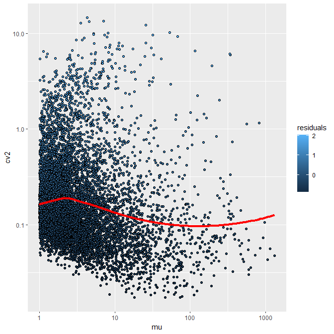
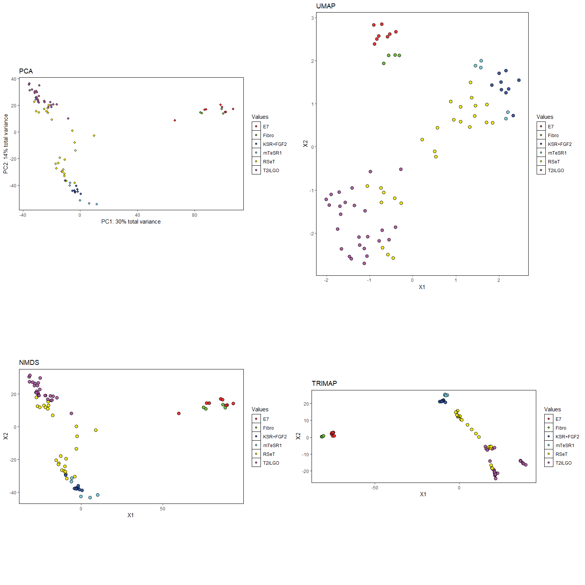
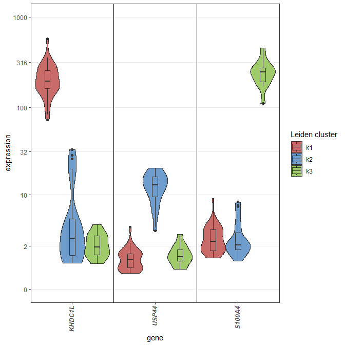
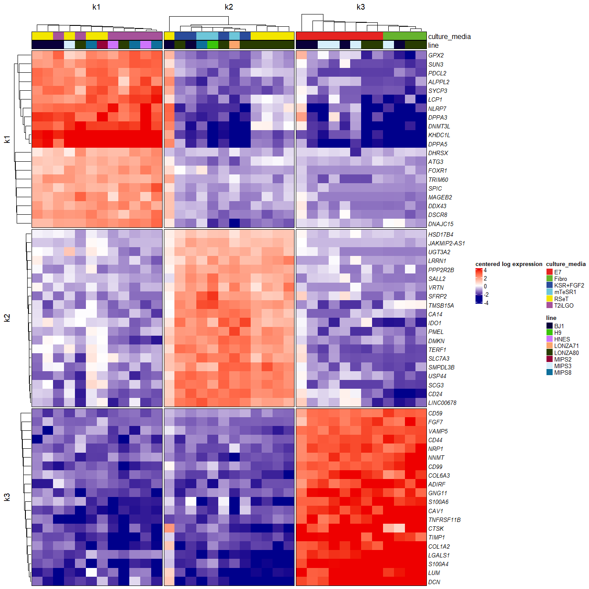
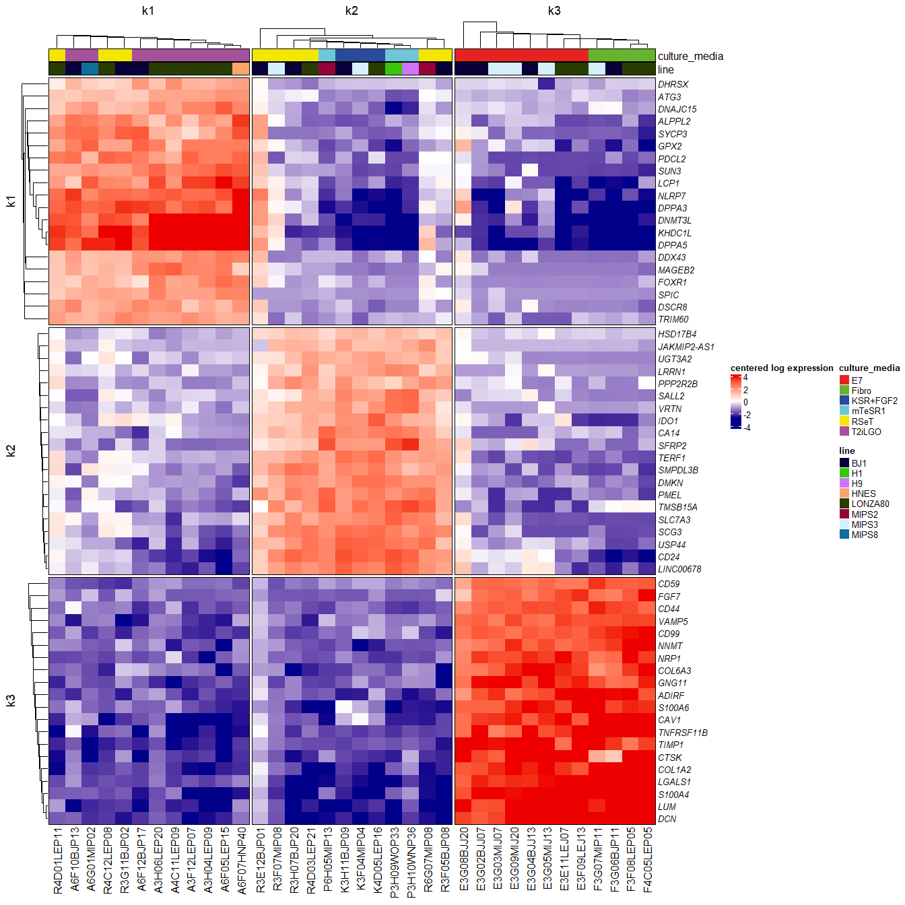
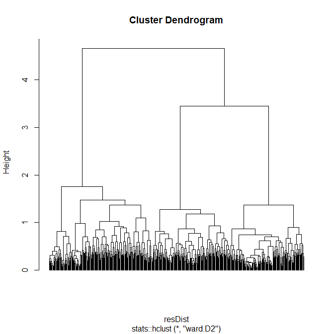
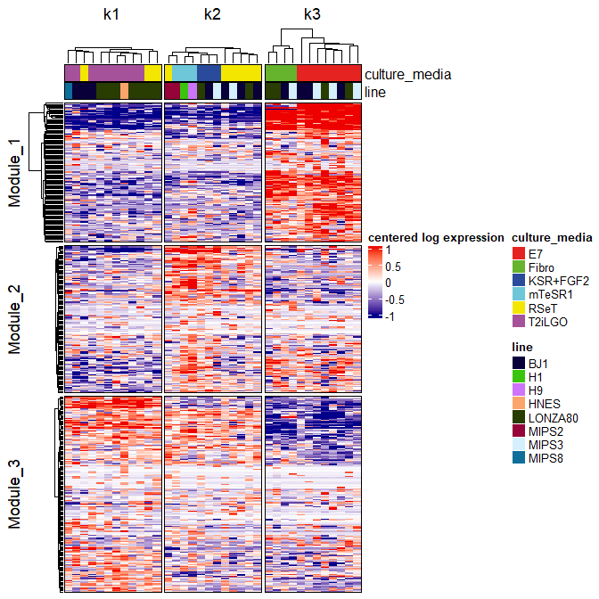

# oob: A Toolbox for Analyzing OMIC Data Out Of Bounds

This package provide function for analyzing OMIC data, with a focus on
plots, functional enrichment and bulk/single-cell RNA-Seq.

## Installation In a R console:

    install.packages("devtools")
    devtools::install_github("https://github.com/DimitriMeistermann/oob",
        build_vignettes = FALSE)

For a manual installation of dependencies:

    install.packages("BiocManager")
    BiocManager::install(
        c("ggplot2","basilisk","batchelor","BiocParallel","BiocGenerics","circlize",
        "ComplexHeatmap","data.table","dbscan","ggbeeswarm","ggrepel","glmnet",
        "grDevices","grid","irlba","labeling","lsa","MASS","Matrix","pvclust",
        "reshape2","reticulate","rgl","Rcpp","RcppArmadillo","rlang","scales",
        "scater","scattermore","scran","SingleCellExperiment",
        "stringr","cli","uwot","graphics","methods","utils","knitr",
        "rmarkdown","qualpalr","WGCNA","SummarizedExperiment")
    )

The package is ready to load.

``` r
library(oob)
```

## Data formatting

Fast read and write of text files containing a dataframe or matrix with
`fastRead` and `fastWrite`. Default format are tabulated separated
value. `chead` is then useful for a quick view of first columns/rows.
`rn`, `cn`, `len`, `inter` are respectively aliases for `rownames`,
`colnames`, `length` and `intersect`.

``` r
#Bulk RNA-Seq log counts from from Kilens, Meistermann & al 2018
data("bulkLogCounts") 
dir.create("test", showWarnings = FALSE)
fastWrite(bulkLogCounts, "test/bulkLogCounts.tsv")
rm(bulkLogCounts)
bulkLogCounts <- fastRead("test/bulkLogCounts.tsv")
chead(bulkLogCounts, n = 10) #quick view of bulkLogCounts
#>        P3E07LSP32 R3E08MIP01 A3E09MIP20 A3E10MIP25 E3E11LEJ07 R3E12BJP01 R3F01BJP03 R3F02MIP03 K3F03BJP03 K3F04MIP04
#> A1BG       0.7031     0.7982     0.0442     0.0442     2.6915     1.5739     0.7296     1.3773     0.9448     1.3465
#> A2M        0.0256     0.9958     0.0000     0.0000     0.2450     1.2847     0.1163     0.0157     0.9306     0.8830
#> A2ML1      1.0645     1.1010     0.3719     1.2047     0.3760     1.6005     1.3253     0.3663     1.2232     0.3834
#> A4GALT     1.1246     1.5890     2.8936     2.3702     1.2442     1.7533     1.6792     1.5236     0.4104     0.4421
#> AAAS       3.3294     3.0880     2.6811     3.0237     2.3443     2.8623     3.0138     3.1165     3.6051     3.6174
#> AACS       2.0621     1.3823     1.0639     1.6621     1.0525     1.8674     2.0116     1.2994     1.4468     0.0000
#> AADAT      0.1166     1.2819     1.0213     0.1895     2.1091     1.7016     1.4465     1.2142     1.8129     1.1494
#> AAED1      1.2258     1.0843     0.0000     0.0000     1.6439     0.7909     0.7430     0.0181     0.6644     0.9484
#> AAGAB      4.0413     3.7013     3.5889     3.6993     3.8790     4.0598     3.7633     3.3143     3.8737     3.9129
#> AAK1       1.1232     1.4225     1.5251     0.0622     1.6696     1.5750     1.6063     0.0825     0.8750     0.8958
rn(bulkLogCounts)[1:10]
#>  [1] "A1BG"   "A2M"    "A2ML1"  "A4GALT" "AAAS"   "AACS"   "AADAT"  "AAED1"  "AAGAB"  "AAK1"
cn(bulkLogCounts)[1:10]
#>  [1] "P3E07LSP32" "R3E08MIP01" "A3E09MIP20" "A3E10MIP25" "E3E11LEJ07" "R3E12BJP01" "R3F01BJP03" "R3F02MIP03" "K3F03BJP03" "K3F04MIP04"
len(rn(bulkLogCounts))
#> [1] 16959
inter(rn(bulkLogCounts)[1:10], rn(bulkLogCounts)[5:15])
#> [1] "AAAS"  "AACS"  "AADAT" "AAED1" "AAGAB" "AAK1"
```

List of vectors can be processed to factor via `VectorListToFactor` or
reciprocally, `factorToVectorList` converts A factor to a list of
vectors, where each level is an element and contains the observation
names having this level. `read.vectorList` and `write.vectorList` are
used to read or write list of vectors in text files.

``` r
#Differential expression (prime vs naive cell lines)
# from Kilens, Meistermann & al 2018
data("DEgenesPrime_Naive")
genesPerSet <- factorToVectorList(
    DEgenesPrime_Naive$isDE, factorNames = rn(DEgenesPrime_Naive)
)
lapply(genesPerSet, head)
#> $DOWNREG
#> [1] "A1BG"    "AADAT"   "AASS"    "ABAT"    "ABHD17B" "ABI2"   
#> 
#> $NONE
#> [1] "A2M"   "A2ML1" "AAAS"  "AACS"  "AAED1" "AAGAB"
#> 
#> $UPREG
#> [1] "A4GALT" "AARS2"  "ABCA1"  "ABCC13" "ABCC2"  "ABCF2"
write.vectorList(genesPerSet, "test/genesDE.tsv")
read.vectorList("test/genesDE.tsv") |> lapply(head)
#> $DOWNREG
#> [1] "A1BG"    "AADAT"   "AASS"    "ABAT"    "ABHD17B" "ABI2"   
#> 
#> $NONE
#> [1] "A2M"   "A2ML1" "AAAS"  "AACS"  "AAED1" "AAGAB"
#> 
#> $UPREG
#> [1] "A4GALT" "AARS2"  "ABCA1"  "ABCC13" "ABCC2"  "ABCF2"
#whichTop used here for retrieving top 10 genes in term of log2(Fold-Change)
top10FC <-
    rn(DEgenesPrime_Naive)[
        whichTop(DEgenesPrime_Naive$log2FoldChange, top = 10)
    ]
copyReadyVector(top10FC) #Ready to be copied in a console !
#> [1] "c('KHDC1L','DNMT3L','NLRP7','SPIC','OLAH','MAGEB2','SUN3','FAM151A','DPPA5','SYCP3')"
```

When set `set.seed` is used the Random Number Generator give a different
result each time it is used. `getRandState`, `setRandState` are used for
retrieving/setting this precise seed state.

``` r
set.seed(666)
rnorm(10)
#>  [1]  0.75331105  2.01435467 -0.35513446  2.02816784 -2.21687445  0.75839618 -1.30618526 -0.80251957 -1.79224083 -0.04203245
rnorm(10)
#>  [1]  2.15004262 -1.77023084  0.86465359 -1.72015590  0.13412567 -0.07582656  0.85830054  0.34490035 -0.58245269  0.78617038
set.seed(666)
rnorm(10)
#>  [1]  0.75331105  2.01435467 -0.35513446  2.02816784 -2.21687445  0.75839618 -1.30618526 -0.80251957 -1.79224083 -0.04203245
randState<-getRandState()
rnorm(10)
#>  [1]  2.15004262 -1.77023084  0.86465359 -1.72015590  0.13412567 -0.07582656  0.85830054  0.34490035 -0.58245269  0.78617038
setRandState(randState)
rnorm(10)
#>  [1]  2.15004262 -1.77023084  0.86465359 -1.72015590  0.13412567 -0.07582656  0.85830054  0.34490035 -0.58245269  0.78617038
```

Data frames can be formatted using metadata with `formatAnnotFromMeta`.
See `?formatAnnotFromMeta` for more information on the format of
metadata.

``` r
df <- data.frame(
    numericVar = 1:12, factorVar = rep(c("1", "19", "2"), each = 4)
)
metaDf <-
    data.frame(
        Type = c("numeric", "factor"),
        colorScale = c("", "1=blue,2=white,19=red"),
        row.names = c("numericVar", "factorVar")
    )
print(metaDf)
#>               Type            colorScale
#> numericVar numeric                      
#> factorVar   factor 1=blue,2=white,19=red
res <- formatAnnotFromMeta(df, metaDf)
print(res)
#>    numericVar factorVar
#> 1           1         1
#> 2           2         1
#> 3           3         1
#> 4           4         1
#> 5           5        19
#> 6           6        19
#> 7           7        19
#> 8           8        19
#> 9           9         2
#> 10         10         2
#> 11         11         2
#> 12         12         2
colorScale<-attr(res, "colorScale")
print(colorScale)
#> $factorVar
#>       1       2      19 
#>  "blue" "white"   "red"
```

## Statistics utilities

The following functions can be applied to a vector of numeric values:

- `Mode`: the mode of a distribution
- `gmean`: geometrical mean $\sqrt[n]{\prod^n_ix_i}$
- `cv`: coefficient of variation $\sigma/\mu$
- `cv2`: coefficient of variation (squared standard deviation and mean)
  $\sigma^2/\mu^2$
- `Mode` (most represented value in distribution)
- `se`: Standard mean error $\sigma/\sqrt{n}$
- Alternative distance of $2-cor(x)$ type for returning a distance
  object usable by function of clustering as `hclust`, two can be used:
  - `corrDist`: Correlation distance. Method used for computing
    correlation can be specified. See `method` argument from `cor`.
  - `covDist`: Covariance distance
  - `cosineDist`: Cosine distance
- `linearScale`: can returned a function able to map one set of value to
  another, for example to map a range of minutes to a range of
  frequency.
- `qauroc`: quick approximation of area under ROC curve implemented in
  C++.

``` r
minutesTofreqScale<-linearScale(c(0,60),c(0,1))
minutesTofreqScale(30)
#> [1] 0.5
```

`reScale` extend the concept of scaling ranges to matrices. A typical
use is to put the range of a batch corrected count table from RNA-Seq on
the same range than the count table before correction.

``` r
m1 <- matrix(rnorm(100), ncol = 50)
p1 <- qplotDensity(m1[1, ], returnGraph = TRUE) +
    ggtitle("Distribution of matrix to adjust")
m2 <- matrix(rnorm(100, 20), ncol = 50)
p2 <-qplotDensity(m2[1, ], returnGraph = TRUE) +
    ggtitle("Distribution of matrix with target ranges")
m1Rescale <- reScale(m1, m2)
p3 <-qplotDensity(m1Rescale[1, ], returnGraph = TRUE) +
    ggtitle("Readjusted matrix")
#multiplot for quick display of several plot at once
multiplot(p1, p2, p3, cols = 2) 
```


`qplotDensity` used here is a quick plotting function for visualizing
distribution. *oob* contains several quick plot wrapper from *ggplot2*:

- `qplotAutoX`: Quick plot of a numeric vector with index as x-axis.
- `qplotBarplot`: Same but with bars instead of points.
- `oobqplot`: copy of `ggplot2::quickplot`, as it is deprecated since
  ggplot2 \>=3.4 but is still useful.

`uncenter` is similar to `reScale` but just shift the values of each
feature so the new minimum is 0. `rowScale` scales a matrix in the same
way than `scale`, but with rows as features, the common format for
RNA-Seq. `aggregMatPerVector` is used to aggregate a matrix by a vector
of factors. It is useful for example to aggregate gene expression by
gene sets.

``` r
data("sampleAnnot")
aggregMatPerVector(bulkLogCounts[c(
    'KHDC1L','DNMT3L','NLRP7','SPIC','OLAH','MAGEB2'
),], sampleAnnot$culture_media)
#>               E7    Fibro   KSR+FGF2  mTeSR1     RSeT   T2iLGO
#> KHDC1L 2.2209000 1.484425 1.49697778 1.60990 5.553344 8.647927
#> DNMT3L 2.5441500 1.417825 1.86412222 1.64406 5.764344 8.024754
#> NLRP7  1.6627375 0.956650 0.83468889 0.97890 4.465220 6.317400
#> SPIC   0.2433500 0.044725 0.08795556 0.36446 1.471476 3.400135
#> OLAH   1.3360875 0.248050 0.31224444 0.75298 2.090316 3.762662
#> MAGEB2 0.5168875 0.165325 0.26643333 0.62160 2.083200 3.695100
```

## Normalization of RNA-Seq

The package can perform several quick normalization methods. Let’s
simulate a fake count table and attribute real gene symbols as row
names.

``` r
# vector of gene length for GRCh38 Human reference, named by gene symbols
data("geneLengthGRCh38") 
library(MASS)
countMat <-
    t(sapply(vector("numeric", length = length(geneLengthGRCh38)), function(x) {
        #generate a fake RNA-Seq dataset
        rnegbin(10, theta = abs(rnorm(1, mean = 10, sd = 20)), 
            mu = abs(rnorm(1, mean = 10, sd = 20)))
}))
colnames(countMat) <-
    letters[1:ncol(countMat)]
rownames(countMat) <- names(geneLengthGRCh38)
chead(countMat)
#>           a  b  c  d  e
#> TSPAN6   20  9 23 22 10
#> TNMD     13 57 11 27 13
#> DPM1      0  0  0  0  3
#> SCYL3    25 10  6 11 10
#> C1orf112 14 30 15 11 15
#Quality control
computeQCmetricSamples(countMat)
#>       mean       sd        CV TotalGenEx TotalCount
#> a 17.84183 18.53505 1.0388539      23804     446349
#> b 17.83439 17.89979 1.0036672      23775     446163
#> c 17.82716 17.89028 1.0035406      23764     445982
#> d 17.85502 17.54812 0.9828118      23800     446679
#> e 17.88184 18.96104 1.0603517      23775     447350
#> f 17.81964 20.50809 1.1508696      23773     445794
#> g 17.74733 17.75208 1.0002677      23794     443985
#> h 17.73734 16.95955 0.9561496      23776     443735
#> i 17.78247 17.15649 0.9647978      23818     444864
#> j 17.80625 16.79565 0.9432443      23806     445459
#Different kind of normalization
CPM(countMat) |> chead() #Count Per Million normalization
#>                 a         b        c        d         e
#> TSPAN6   44.80799  20.17200 51.57159 49.25237 22.353862
#> TNMD     29.12519 127.75600 24.66467 60.44609 29.060020
#> DPM1      0.00000   0.00000  0.00000  0.00000  6.706158
#> SCYL3    56.00998  22.41333 13.45346 24.62619 22.353862
#> C1orf112 31.36559  67.24000 33.63364 24.62619 33.530792
normDeseq(countMat) |> chead() #DESeq2 normalization
#>                 a         b         c        d         e
#> TSPAN6   19.40455  8.739744 22.259615 21.26538  9.684225
#> TNMD     12.61296 55.351712 10.645903 26.09842 12.589492
#> DPM1      0.00000  0.000000  0.000000  0.00000  2.905267
#> SCYL3    24.25569  9.710827  5.806856 10.63269  9.684225
#> C1orf112 13.58319 29.132480 14.517140 10.63269 14.526337
#Single-cell (scran) normalization (return log counts by default)
quickSCnorm(countMat) |> chead()
#>                 a        b        c        d        e
#> TSPAN6   4.390121 3.320394 4.583889 4.520336 3.454398
#> TNMD     3.805213 5.856305 3.583936 4.804103 3.802213
#> DPM1     0.000000 0.000000 0.000000 0.000000 1.995848
#> SCYL3    4.698222 3.457882 2.806395 3.581871 3.454398
#> C1orf112 3.904738 4.952546 3.998950 3.581871 3.994809
#Reads Per Kilobase per Million (RPKM) normalization for 
#full-length transcript, short read sequencing.
RPKM(countMat, gene.length = geneLengthGRCh38) |> chead()
#>                  a         b         c         d         e
#> TSPAN6    9.880482  4.448071 11.371905 10.860501  4.929187
#> TNMD     18.090181 79.351552 15.319672 37.544157 18.049702
#> DPM1      0.000000  0.000000  0.000000  0.000000  5.556055
#> SCYL3     8.137438  3.256332  1.954592  3.577827  3.247692
#> C1orf112  5.256509 11.268644  5.636609  4.127063  5.619372
#Transcript per milion (TPM) normalization for full-length transcript,
#short read sequencing.
TPMfullLength(countMat, gene.length = geneLengthGRCh38) |> chead() 
#>                  a         b         c         d         e
#> TSPAN6    7.623907  3.391072  8.785572  8.196325  3.864663
#> TNMD     13.958616 60.495183 11.835491 28.334246 14.151627
#> DPM1      0.000000  0.000000  0.000000  0.000000  4.356151
#> SCYL3     6.278952  2.482527  1.510056  2.700155  2.546309
#> C1orf112  4.055990  8.590868  4.354664  3.114658  4.405793
```

Eventually, `oobFastMNN` can be used to perform a quick batch correction
with the simple *one matrix in, one matrix out* format. \## Principal
Component Analysis tools Principal Component Analysis can be performed
with `PCA` or approximated with `fastPCA` with parameters optimized by
default for RNA-Seq. Result can be then plotted with `pca2d`.

``` r
data("sampleAnnot") #colData of the count table
PCAres <- PCA(bulkLogCounts)
# /!\ for fastPCA percentage of explained var is on the total of computed PC 
# (less PC -> increase percentage)
PCAresQuick <-
    fastPCA(bulkLogCounts, nPC = 2) 
multiplot(
    pca2d(
        PCAres,
        returnGraph = TRUE,
        main = "PCA on bulkLogCounts",
        colorBy = sampleAnnot$culture_media
    ),
    pca2d(
        PCAresQuick,
        returnGraph = TRUE,
        main = "estimation with fastPCA",
        colorBy = sampleAnnot$culture_media
    ),
    pca2d(
        PCAres,
        plotVars = TRUE,
        outlierLabel = TRUE,
        returnGraph = TRUE,
        main = "Contribution of genes for PC 1 & 2"
    ),
    barplotPercentVar(PCAres, returnGraph = TRUE, nPC = 30) + 
        ggtitle("Scree plot of explained variance per PC"),
    cols = 2
)
```


In the gene contribution plot, `pointdensity.nrd` is used for estimating
the 2 density of points. `pcaAddSamples` is another PCA function than
can be used to add new samples to the PCA. For linking experimental
variable to principal components we can perform a Principal Component
analysis of variance.

``` r
library(ggbeeswarm)
resPC_aov <-
    PCaov(
        PCAres, colData = sampleAnnot[, c("culture_media", "line", "passage")]
    )
ggBorderedFactors(
    ggplot(resPC_aov, aes(
        x = PC, y = sumSqPercent, fill = feature
    )) +
    geom_beeswarm(pch = 21, size = 4, cex = 3) +
    xlab("Principal component") + ylab("% Sum of Squares") +
    scale_fill_manual(values = oobColors(nlevels(resPC_aov$feature))) +
    theme(
        panel.grid.major.y = element_line(colour = "grey75"),
        panel.grid.minor.y = element_line(colour = "grey75"),
        panel.background = element_rect(fill = NA, colour = "black")
    )
)
```


The culture media seems to be linked here with PC 1 & 2. Note in the
code the use of `mostDistantColor` for generating a color scale with
maximum contrast and `ggBorderedFactors` for moving vertical line break
between factors in a *ggplot2* function. \## Characterize features of
RNA-Seq We can first filter the count table by computing an
overdispersion score for each gene with `getMostVariableGenes`. This
function must be executed on a normalized, not log transformed count
table. We hence have to “unlog” it.

``` r
normCount <- 2 ^ (bulkLogCounts - 1)
dispData <- getMostVariableGenes(normCount, minCount = 1)
```



``` r
overdispersedGenes <- rn(dispData)[dispData$residuals > 0]
length(overdispersedGenes)
#> [1] 4028
```

We can then compute a PCA on these genes that will result in a reduced
dimension space that will be used for downstream analyses.

``` r
reducedSpace <- t(fastPCA(bulkLogCounts[overdispersedGenes, ], nPC = 30))
```

For example, we can perform non linear dimension reductions. Several are
provided with the package: `NMDS`, `UMAP` and `TRIMAP`. The result is
plotted with `proj2d`.

``` r
reducedSpace <-
    t(fastPCA(bulkLogCounts[overdispersedGenes, ], nPC = 30)$x)
chead(reducedSpace)
#>       P3E07LSP32 R3E08MIP01 A3E09MIP20  A3E10MIP25  E3E11LEJ07
#> PC1   0.08257998  -8.905635  18.272929   6.0898056 -89.2020967
#> PC2  42.50375008   2.073339 -16.236969  -8.3071475 -13.3994248
#> PC3   1.07668171 -15.241565 -14.630569 -13.8937491  -0.3845952
#> PC4  -6.53768721  -3.562575   3.176719  -0.4743893  -4.0716714
#> PC5 -15.38921203   1.870331  -3.234557  -1.6699761  -5.8401730
coordNMDS <- NMDS(reducedSpace)
#> initial  value 14.274929 
#> final  value 14.261433 
#> converged
coordUMAP <- UMAP(reducedSpace, n_neighbors = ncol(reducedSpace))
coordTRIMAP <- TRIMAP(reducedSpace)
#> TRIMAP(n_inliers=10, n_outliers=5, n_random=5, distance=euclidean, lr=1000.0, n_iters=400, weight_adj=500.0, apply_pca=True, opt_method=dbd, verbose=True, return_seq=False)
#> running TriMap on 77 points with dimension 30
#> pre-processing
#> found nearest neighbors
#> sampled triplets
#> running TriMap with dbd
#> Iteration:  100, Loss: 3.010, Violated triplets: 0.0711
#> Iteration:  200, Loss: 2.857, Violated triplets: 0.0675
#> Iteration:  300, Loss: 2.756, Violated triplets: 0.0651
#> Iteration:  400, Loss: 2.686, Violated triplets: 0.0634
#> Elapsed time: 0:00:00.136649
multiplot(
    cols = 2,
    pca2d(
        PCAres,
        colorBy = sampleAnnot$culture_media,
        returnGraph = TRUE,
        main = "PCA",
        ratioPerPercentVar = TRUE
    ),
        proj2d(
        coordNMDS,
        colorBy = sampleAnnot$culture_media,
        returnGraph = TRUE,
        main = "NMDS",
        fixedCoord = TRUE
    ),
        proj2d(
        coordUMAP,
        colorBy = sampleAnnot$culture_media,
        returnGraph = TRUE,
        main = "UMAP",
        fixedCoord = TRUE
    ),
    proj2d(
        coordTRIMAP,
        colorBy = sampleAnnot$culture_media,
        returnGraph = TRUE,
        main = "TRIMAP",
        fixedCoord = TRUE
    )
)
```



`proj1d` and `proj3d` are also available for 1D and 3D projections. Note
that `proj3d` is using the `rgl` package. The knn graph used can also be
saved when computing the UMAP, and used for a community detection
(Leiden) clustering.

``` r
UMAPwithNN <-
    UMAP(reducedSpace,
        n_neighbors = ncol(reducedSpace),
        ret_nn = TRUE)
sampleAnnot$leidenClusters <- leidenFromUMAP(UMAPwithNN)
proj2d(
    UMAPwithNN$embedding,
    colorBy = sampleAnnot$leidenClusters,
    plotFactorsCentroids = TRUE,
    plotLabelRepel = TRUE,
    fixedCoord = TRUE,
    legendTitle = "Leiden cluster"
)
```


We now pick the best marker per cluster with `getMarkers`, which use the
`auroc` function for computing marker scores, along with
*log2Fold-Change* and *p-value*.

``` r
markerPerCluster <-getMarkers(bulkLogCounts[overdispersedGenes, ],
    group = sampleAnnot$leidenClusters)
chead(markerPerCluster)
#>            k1.lfc  k1.auroc  k1.score      k1.pval      k1.padj
#> A1BG   -1.0768310 0.1554422 -1.389625 5.855828e-08 2.227316e-07
#> A4GALT  1.1012386 0.9578231  1.969951 6.869410e-16 9.013024e-15
#> AAK1   -0.1796876 0.4027211 -0.233799 1.857275e-01 2.166552e-01
#> AARS2   0.8521467 0.8782313  1.428687 8.959301e-10 4.516654e-09
#> AASS   -0.8434000 0.2734694 -0.827172 1.090721e-03 1.883973e-03
```

Now we pick up the best marker per cluster, and plot them. Note the
$log_{10}(n+1)$ scale accessible as a scale for any ggplot with
`log10plus1`. More generally, for any custom ggplot scale created with
`scales::trans_new`, `ggplotBreak` can be used to determine the axis
breaks. `extractFeatureMarkerData` is used to extract one value per
cluster per gene (by default the marker score).

``` r
markerScorePerCluster <- extractFeatureMarkerData(markerPerCluster)
head(markerScorePerCluster) #matrix of marker scores
#>                k1         k2         k3
#> A1BG   -1.3896249  0.0000000  2.6999342
#> A4GALT  1.9699515 -1.3579995 -0.5425076
#> AAK1   -0.2337990 -0.1989542  0.9002681
#> AARS2   1.4286870 -0.6045051 -1.0212258
#> AASS   -0.8271720  2.3471458 -1.6273016
#> ABCA1   0.7786247 -1.1834598  0.3623288
top20MarkerPerCluster <-
    apply(markerScorePerCluster, 2, function(x)
        rownames(markerPerCluster)[whichTop(x, top = 20)]) |> 
        data.frame() |> as.list()
topGenePerCluster <- sapply(top20MarkerPerCluster, function(x)
    x[1])
plotExpr(normCount[topGenePerCluster, ],
        group = sampleAnnot$leidenClusters,
        legendTitle = "Leiden cluster")
```



We then used those marker for plotting an heatmap with the dedicated
function.

``` r
htMarker(
    bulkLogCounts,
    markerData = markerScorePerCluster,
    topn = 20 ,
    group = sampleAnnot$leidenClusters,
    colData = sampleAnnot[c("culture_media", "line")]
)
```



Note that we can obtain the same result with more struggles using the
more general function `heatmap.DM`:

``` r
#convert the list to a factor
top20MarkerFactor <- VectorListToFactor(top20MarkerPerCluster)
#We subsampled the matrix so each cluster
#give the same number of sample in the heatmap
drawRes <-
    drawSamplePerGroup(
        rn(sampleAnnot),
        sampleAnnot$leidenClusters,
    )
drawnSamples <- names(drawRes)
heatmap.DM(
    bulkLogCounts[names(top20MarkerFactor), drawnSamples],
    colData = sampleAnnot[drawnSamples, c("culture_media", "line")],
    column_split = drawRes,
    row_split = top20MarkerFactor,
    cluster_row_slices = FALSE,
    cluster_column_slices = FALSE
)
```



`autoGparFontSizeMatrix` is used by `heatmap.DM` to adjust row and
column size to the number of samples / features. `heatmap.DM` is a
wrapper for `ComplexHeatmap`. It uses `genColorsForAnnots` and
`genTopAnnot` are for generating top annotations. The proper heatmap
color scale is generated using `computeColorScaleFun` which is able to
map colors to percentiles. Example:

``` r
values = sort(rnorm(100))
computeColorScaleFun(
    colors = c("blue", "white", "red"),
    values = values,
    returnColorFun = FALSE,
    useProb = TRUE,
    probs = c(.25, .5, .75)
) |>
    plotPalette()
```


`computeColorScaleFun` can also return a ggplot scale if
`returnGGscale=TRUE`. `volcanoPlot.DESeq2` is designed to show the
result of differential expression analysis in a meaningful way. See
`volcanoPlot` for a more general function that works outside the context
of differential expression analysis.

``` r
data("DEgenesPrime_Naive")
volcanoPlot.DESeq2(
    DEgenesPrime_Naive,
    formula = "~culture_media+Run",
    condColumn = "culture_media",
    downLevel = "KSR+FGF2",
    upLevel = "T2iLGO"
)
```


Finally, `richUpset` is used to compare intersection between gene set
with an additional value of enrichment. Here we compare the marker of
unsupervised cluster and differential expression results between naive
and primed pluripotency.

``` r
sets = list(
    k1 = rn(markerPerCluster)[markerPerCluster$k1.padj < 0.05],
    k2 = rn(markerPerCluster)[markerPerCluster$k2.padj < 0.05],
    k3 = rn(markerPerCluster)[markerPerCluster$k3.padj < 0.05],
    primeVSnaiveUP = rn(DEgenesPrime_Naive)[DEgenesPrime_Naive$isDE ==
        "UPREG"],
    primeVSnaiveDOWN = rn(DEgenesPrime_Naive)[DEgenesPrime_Naive$isDE ==
        "DOWNREG"]
)
richUpset(sets, universe = rn(markerPerCluster))
```


You can get the values computed for `richUpset` with `richUpsetStats`.
The more general function `enrichSetIntersection` is used internally to
compute the enrichment of an intersection of *n* set. The OE deviation
is a metric designed for this package to measure an enrichment in a an
over-representation analysis. It is computed as the difference between
the observed and expected intersection size, normalised by the square
root of the universe size: $\Psi =
\frac{O-E}{\sqrt{\Omega}}$ With $\Omega}$ the universe size, $O$ the
observed intersection size and $E$ the expected intersection size. $E$
can be computed in the context of intersection of $n$ set with the
following formula: $E=
\frac{\prod{^n_ix_i}}{\Omega^{n-1}}$ with $x_i$ the number of element in
a set, $n$ the number of set and $\Omega$ the universe size.

## Hierarchical clustering

`hierarchicalClustering` enhance `hclust` by several manners:

- Use the `ward.D2` method by default.
- It takes matrix as input and compute the distance matrix and the
  clustering in one step.
- It is able to bootstrap the clustering to assess the robustness of the
  clustering with the `pvclust` method.

Let’s compute gene modules using `hierarchicalClustering`. For reducing
the computation time we will use only the highly variable genes with
enough counts. Correlation distance is used to compute the distance
matrix.

``` r
geneClustering <- hierarchicalClustering(
    bulkLogCounts[dispData$residuals > 1 & dispData$mu > 2,],
    transpose = FALSE, method.dist = "pearson"
)
plot(geneClustering, hang=-1, labels = FALSE)
```



``` r
best.cutree(geneClustering, graph = TRUE)
```


With the help of `best.cutree` and the shape of the plotted dendrogram,
we can deduce that 3 clusters is a good choice for the number of
clusters. We can extract the cluster membership with `cutree`:

``` r
geneClusters <- paste0("Module_",cutree(geneClustering, k = 3))
names(geneClusters) <- geneClustering$labels
heatmap.DM(
    bulkLogCounts[names(geneClusters), drawnSamples],
    row_split = geneClusters,
    column_split = drawRes,
    cluster_row_slices = FALSE,
    cluster_column_slices = FALSE,
    colData = sampleAnnot[drawnSamples, c("culture_media", "line")],
    show_row_names = FALSE,
    show_column_names = FALSE
)
```



## Other utilities functions:

- `corGeneToOthers` : Compute the correlation of a gene to all other
  genes in a matrix.
- `supprNAnames`: Delete row/column in a matrix/df with NA row/colnames
- `takefirst`: Similar to unique but conserve vector names or return
  index where you can find each first value of multiple element.
- `formatNumber2Character`: Convert numeric to string, potentially add
  “0” before the number after conversion to respect lexicographical
  order.
- `strsplitNth`: Character split with chosen returned element, return a
  vector.
- `make.unique2`: Similar to make.unique, but also add a sequence member
  for the first encountered duplicated element.
- `matrixCoord1D_2D`: Return the row and column index (2D coordinate)
  from a 1D coordinate in a matrix.
- `matrixFromDimnames`: Return the row and column index (2D coordinate)
  from a 1D coordinate in a matrix.
- `factorAsStrings` : Convert the factors of a data frame to strings.
- *oob* features additional functions for dealing with colors:
  - `oobColors`: Generate pretty and distinct values for a qualitative
    scale.
  - `mostDistantColor`: Most distant theoretical color palette for a
    qualitative scale (wrapper for *qualpal* if installed).
  - `ggplotColours`: generate the default colors of *ggplot2* for a
    qualitative scale.
  - `convertColorAdd2Sub`: Convert color from additive to subtracting
    mixing.
  - `extendColorPalette`: Extend a color palette with new color by
    interpolation.
  - `sortColorByDistance`: Sort a color palette by how close they are.

## Compatibility with SummarizedExperiment and SingleCellExperiment

The package is compatible with `SummarizedExperiment` and
`SingleCellExperiment` objects. The following functions can interact
with these (see examples).

- `getMostVariableGenes`
- `getMarkers`
- `getMarkerGLMnet`
- `heatmap.DM`
- `plotExpr`
- `CPM`
- `TPMfullLength`
- `RPKM`
- `computeQCmetricSamples`
- `normDeseq`
- `oobFastMNN`
- `pcaAddSamples`
- `PCA`
- `fastPCA`
- `UMAP`
- `TRIMAP`
- `NMDS`
- `leidenFromUMAP`
- `pca2d`
- `proj2d`

## Session info

``` r
sessionInfo()
#> R version 4.4.1 (2024-06-14 ucrt)
#> Platform: x86_64-w64-mingw32/x64
#> Running under: Windows 11 x64 (build 22631)
#> 
#> Matrix products: default
#> 
#> 
#> locale:
#> [1] LC_COLLATE=French_France.utf8  LC_CTYPE=French_France.utf8    LC_MONETARY=French_France.utf8 LC_NUMERIC=C                   LC_TIME=French_France.utf8    
#> 
#> time zone: Europe/Helsinki
#> tzcode source: internal
#> 
#> attached base packages:
#> [1] stats4    grid      stats     graphics  grDevices utils     datasets  methods   base     
#> 
#> other attached packages:
#>  [1] rmarkdown_2.28              ggbeeswarm_0.7.2            MASS_7.3-61                 oob_0.99.0                  SingleCellExperiment_1.26.0
#>  [6] SummarizedExperiment_1.34.0 Biobase_2.64.0              GenomicRanges_1.56.1        GenomeInfoDb_1.40.1         IRanges_2.38.1             
#> [11] S4Vectors_0.42.1            BiocGenerics_0.50.0         MatrixGenerics_1.16.0       matrixStats_1.4.1           ComplexHeatmap_2.20.0      
#> [16] ggplot2_3.5.1              
#> 
#> loaded via a namespace (and not attached):
#>   [1] splines_4.4.1             batchelor_1.20.0          bitops_1.0-8              filelock_1.0.3            tibble_3.2.1              preprocessCore_1.66.0    
#>   [7] basilisk.utils_1.16.0     graph_1.82.0              rpart_4.1.23              XML_3.99-0.17             lifecycle_1.0.4           httr2_1.0.4              
#>  [13] fastcluster_1.2.6         gert_2.1.1                edgeR_4.2.1               doParallel_1.0.17         processx_3.8.4            lattice_0.22-6           
#>  [19] qualpalr_0.4.4            credentials_2.0.1         backports_1.5.0           SnowballC_0.7.1           magrittr_2.0.3            Hmisc_5.1-3              
#>  [25] limma_3.60.4              yaml_2.3.10               metapod_1.12.0            askpass_1.2.0             RUnit_0.4.33              reticulate_1.39.0        
#>  [31] DBI_1.2.3                 RColorBrewer_1.1-3        ResidualMatrix_1.14.1     abind_1.4-8               zlibbioc_1.50.0           purrr_1.0.2              
#>  [37] RCurl_1.98-1.16           nnet_7.3-19               rgl_1.3.1                 rappdirs_0.3.3            circlize_0.4.16           GenomeInfoDbData_1.2.12  
#>  [43] ggrepel_0.9.6             irlba_2.3.5.1             dqrng_0.4.1               commonmark_1.9.1          DelayedMatrixStats_1.26.0 codetools_0.2-20         
#>  [49] DelayedArray_0.30.1       scuttle_1.14.0            xml2_1.3.6                tidyselect_1.2.1          shape_1.4.6.1             UCSC.utils_1.0.0         
#>  [55] farver_2.1.2              randtoolbox_2.0.4         ScaledMatrix_1.12.0       viridis_0.6.5             dynamicTreeCut_1.63-1     BiocFileCache_2.12.0     
#>  [61] base64enc_0.1-3           jsonlite_1.8.8            GetoptLong_1.0.5          BiocNeighbors_1.22.0      Formula_1.2-5             survival_3.7-0           
#>  [67] scater_1.32.1             iterators_1.0.14          foreach_1.5.2             dbscan_1.2-0              tools_4.4.1               snow_0.4-4               
#>  [73] stringdist_0.9.12         Rcpp_1.0.13               glue_1.7.0                gridExtra_2.3             SparseArray_1.4.8         BiocBaseUtils_1.6.0      
#>  [79] xfun_0.47                 dplyr_1.1.4               withr_3.0.1               BiocManager_1.30.25       fastmap_1.2.0             basilisk_1.16.0          
#>  [85] bluster_1.14.0            fansi_1.0.6               openssl_2.2.1             callr_3.7.6               digest_0.6.37             rsvd_1.0.5               
#>  [91] R6_2.5.1                  colorspace_2.1-1          GO.db_3.19.1              Cairo_1.6-2               scattermore_1.2           RSQLite_2.3.7            
#>  [97] utf8_1.2.4                generics_0.1.3            data.table_1.16.0         FNN_1.1.4                 httr_1.4.7                htmlwidgets_1.6.4        
#> [103] S4Arrays_1.4.1            rngWELL_0.10-9            uwot_0.2.2                pkgconfig_2.0.3           gtable_0.3.5              blob_1.2.4               
#> [109] impute_1.78.0             XVector_0.44.0            sys_3.4.2                 htmltools_0.5.8.1         RBGL_1.80.0               clue_0.3-65              
#> [115] scales_1.3.0              png_0.1-8                 scran_1.32.0              knitr_1.48                rstudioapi_0.16.0         reshape2_1.4.4           
#> [121] rjson_0.2.23              checkmate_2.3.2           curl_5.2.2                biocViews_1.72.0          cachem_1.1.0              GlobalOptions_0.1.2      
#> [127] stringr_1.5.1             parallel_4.4.1            vipor_0.4.7               foreign_0.8-87            AnnotationDbi_1.66.0      pillar_1.9.0             
#> [133] vctrs_0.6.5               lsa_0.73.3                BiocSingular_1.20.0       dbplyr_2.5.0              beachmat_2.20.0           cluster_2.1.6            
#> [139] htmlTable_2.4.3           beeswarm_0.4.0            evaluate_1.0.0            cli_3.6.3                 locfit_1.5-9.10           compiler_4.4.1           
#> [145] rlang_1.1.4               crayon_1.5.3              labeling_0.4.3            RcppArmadillo_14.0.2-1    ps_1.8.0                  plyr_1.8.9               
#> [151] stringi_1.8.4             WGCNA_1.72-5              viridisLite_0.4.2         BiocParallel_1.38.0       assertthat_0.2.1          BiocCheck_1.40.0         
#> [157] Biostrings_2.72.1         munsell_0.5.1             glmnet_4.1-8              Matrix_1.7-0              dir.expiry_1.12.0         sparseMatrixStats_1.16.0 
#> [163] bit64_4.0.5               KEGGREST_1.44.1           statmod_1.5.0             highr_0.11                igraph_2.0.3              memoise_2.0.1            
#> [169] bit_4.0.5
```

